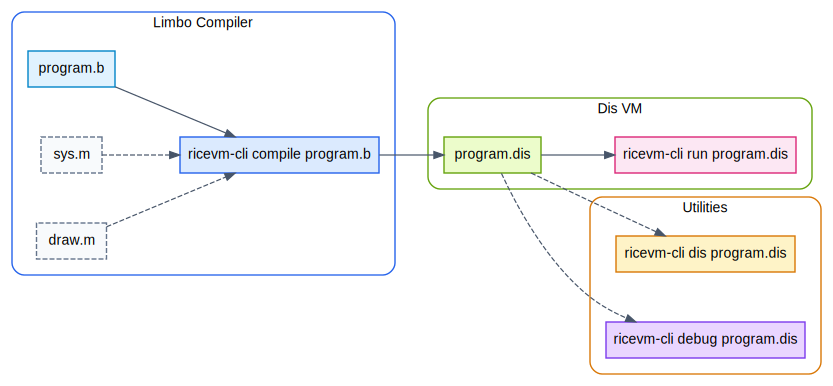

# Getting Started

## Build from Source

RiceVM needs Rust 1.92.0 or newer to build.
The optional GUI feature needs SDL2.

```bash
# Clone the repository with the Inferno OS submodule
git clone --recursive --depth=1 https://github.com/habedi/ricevm.git
cd ricevm

# Build in release mode
cargo build --release

# Verify the build
cargo run -p ricevm-cli -- --version
```

### Optional Features

```bash
# Build with SDL2 GUI support (needs `libsdl2-dev` on Debian/Ubuntu)
cargo build --release --features gui

# Build with audio support
cargo build --release --features audio
```

## Running Programs

### Run a Pre-compiled Inferno Program

```bash
cargo run -p ricevm-cli -- run external/inferno-os/dis/echo.dis \
    --probe external/inferno-os/dis -- hello world
```

### Compile and Run a Limbo Program

Write a Limbo source file:

```limbo
implement Hello;

include "sys.m";
include "draw.m";

Hello: module {
    init: fn(ctxt: ref Draw->Context, argv: list of string);
};

init(ctxt: ref Draw->Context, argv: list of string) {
    sys := load Sys Sys->PATH;
    sys->print("hello, world\n");
}
```

Compile with the built-in compiler and run:

```bash
# Compile .b to .dis
cargo run -p ricevm-cli -- compile hello.b

# Run the compiled bytecode
cargo run -p ricevm-cli -- run hello.dis --probe external/inferno-os/dis
```

Or use the reference Inferno Limbo compiler (runs on RiceVM itself):

```bash
cargo run -p ricevm-cli -- run external/inferno-os/dis/limbo.dis \
    --probe external/inferno-os/dis --probe external/inferno-os/dis/lib \
    -- -I external/inferno-os/module hello.b
```

### Disassemble a Module

```bash
cargo run -p ricevm-cli -- dis external/inferno-os/dis/echo.dis
```

### Debug a Program

```bash
cargo run -p ricevm-cli -- debug external/inferno-os/dis/echo.dis \
    --probe external/inferno-os/dis
```

## Built-in and Loaded Modules

RiceVM has two kinds of modules:

Built-in modules are compiled into the binary and need no external files:

| Module     | Description                                   |
|------------|-----------------------------------------------|
| `$Sys`     | System I/O, formatting, process control       |
| `$Math`    | Trigonometry, linear algebra, bit conversions |
| `$Draw`    | Graphics via SDL2 (optional `gui` feature)    |
| `$Tk`      | Widget toolkit                                |
| `$Keyring` | MD5, SHA1, and authentication stubs           |
| `$Crypt`   | Cryptographic stubs                           |

Programs that only use built-in modules run without any flags:

```bash
ricevm-cli compile hello.b
ricevm-cli run hello.dis     # Works because $Sys is built into RiceVM
```

Loaded modules are `.dis` files on disk (like `bufio.dis`, `regex.dis`, `daytime.dis`) that programs load at runtime via the `load` instruction.
These need `--probe` paths so the VM can find them:

```bash
# Programs using Bufio, regex, or other library modules
ricevm-cli run wc.dis --probe /path/to/dis --probe /path/to/dis/lib
```

If you cloned with `--recursive`, the Inferno OS submodule provides these modules:

```bash
ricevm-cli run program.dis \
    --probe external/inferno-os/dis \
    --probe external/inferno-os/dis/lib
```

!!! tip "Pre-built release binaries"
    Release binaries do not include the Inferno module files. Clone the repository
    with `git clone --recursive` to get them, or download the `.dis` files separately
    from the [Inferno OS repository](https://github.com/inferno-os/inferno-os).

## CLI Reference

| Subcommand | Description                                            |
|------------|--------------------------------------------------------|
| `run`      | Execute a `.dis` module file                           |
| `compile`  | Compile a Limbo `.b` source to `.dis` bytecode         |
| `dis`      | Disassemble a `.dis` module into human-readable output |
| `debug`    | Debug a `.dis` module interactively                    |

### Common Flags

| Flag           | Description                                             |
|----------------|---------------------------------------------------------|
| `--probe PATH` | Add a directory to the module search path (repeatable)  |
| `--root PATH`  | Map Inferno root paths to a host directory              |
| `--trace`      | Print each instruction as it executes                   |
| `--no-gc`      | Disable mark-and-sweep garbage collection               |
| `-I PATH`      | Include search path for `.m` files (compile subcommand) |
| `-o PATH`      | Output file path (compile subcommand)                   |

### CLI Usage Workflow

<p align="center">
  
</p>
